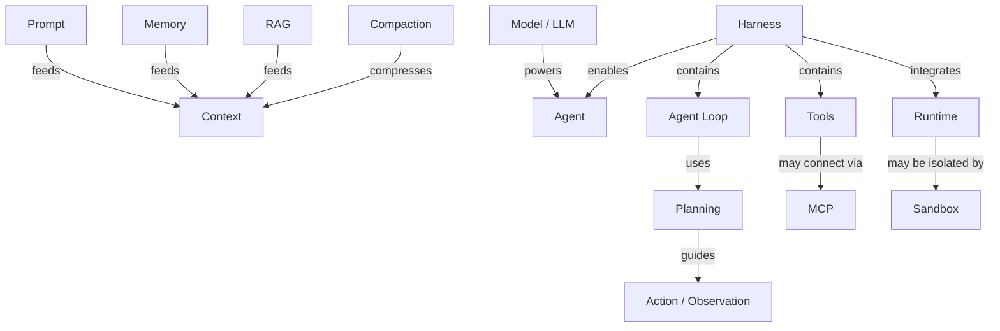

# 核心概念地图

> **Don't just define the term. Locate it.**

Agent Atlas 的核心不是一串互不相关的术语，而是一张不断生长的 **Agent Engineering Concept Graph**。

这张图的作用不是声称“所有 Agent 都必须按这种架构实现”，而是帮助学习者回答三个问题：

1. 我现在看到的这个词，大致属于 Agent 系统的哪一层？
2. 它依赖谁、影响谁、通常和谁一起出现？
3. 如果我已经懂了这个词，下一步最值得理解哪个相邻概念？

## v0.2 核心骨架

这张 ASCII 图会长期保留，因为它是最适合第一次建立整体直觉的版本：

```text
                       ┌── Prompt
                       │
                  Context
                ↙      ↓       ↘
             Memory   RAG    Compaction
                │
                ↓
Model ─────→ Agent ←──── Harness
                         │
            ┌────────────┼────────────┐
            ↓            ↓            ↓
        Agent Loop      Tools       Runtime
            │            │            │
            ↓            ↓            ↓
         Planning       MCP        Sandbox
            │
            ↓
      Action/Observation
```

## 可点击 Concept Graph v1

下面是同一套核心骨架的第一版交互视图。**点击已有词条的节点，可以直接进入对应概念页。**



!!! note "怎么看这张交互图"
    箭头上的词不是装饰，而是在尝试表达**关系类型**。例如 `Memory --feeds--> Context` 表示 Memory 中的信息可以被取回并进入当前 Context；`Harness --contains--> Agent Loop` 表示在我们的工程心智模型里，Agent Loop 通常是 Harness 的一个核心组成部分。

!!! warning "这不是唯一正确的 Agent 架构"
    不同框架会把边界画得不一样。Agent Atlas 记录的是**帮助学习和比较的概念关系**，不是要把某一种产品架构包装成统一标准。

## 怎么读这张图？

### Model → Agent

`Model` 提供语言理解、生成与推理能力，但一个能够持续完成任务的 `Agent` 通常还需要模型之外的执行机制。

所以阅读 Agent 系统时，一个非常重要的问题是：

> 现在描述的是 **model capability**，还是 **agent system capability**？

很多初学者会把两者混在一起。

### Context → Memory / RAG / Compaction

`Context` 是模型在一次调用时实际能看到的信息集合。

它的内容可能来自：

- Prompt / system instructions
- 当前对话历史
- Memory 中取回的信息
- RAG 检索结果
- Tool results
- Files / repository context

而 `Compaction` 解决的是：当历史越来越长时，怎样压缩旧信息，同时尽量保留继续完成任务所需的内容。

因此：

```text
Memory ≠ Context
RAG ≠ Memory
Compaction ≠ Summarization 的简单同义词
```

它们都与 Context 有关，但负责的是不同问题。

### Harness → Agent Loop / Tools / Runtime

`Harness` 可以暂时理解为：**围绕模型、让 Agent 能可靠工作的外围执行与控制系统。**

其中经常会包含：

```text
Harness
├── Agent Loop
├── Context management
├── Tool dispatch
├── State management
├── Permissions
├── Retry / recovery
├── Runtime integration
└── Tracing / observability
```

注意：这是一种帮助理解的分解，不是统一标准。

### Agent Loop → Planning → Action / Observation

Agent Loop 是 Agent 持续工作的“心跳”。

一个最小抽象可以写成：

```text
观察当前状态
   ↓
决定下一步
   ↓
执行 Action
   ↓
获得 Observation
   ↓
更新 Context / State
   ↓
继续下一轮或结束
```

`Planning` 可能发生在一次循环前，也可能在循环过程中不断重规划。

### Tools → MCP

`Tools` 是 Agent 能够调用的外部能力，例如：

- 搜索
- 数据库查询
- 文件读写
- Shell / code execution
- 浏览器
- 邮件 / 日历 / Slack

`MCP` 不是“Tool”的同义词。它更接近一种标准化连接方式，让客户端 / Agent 系统能够发现并使用外部提供的 tools、resources 等能力。

### Runtime → Sandbox

`Runtime` 关注 Agent 的代码、工具调用或任务到底在哪个执行环境中运行。

`Sandbox` 则强调隔离和限制：即使 Agent 能执行代码，也不应默认拥有对真实机器、凭据、网络和文件系统的无限权限。

因此：

```text
Sandbox 通常属于 Runtime / execution environment 的一个重要设计问题
Runtime 不等于 Sandbox
```

---

## Concept Graph 的关系类型

为了让后续知识库可以真正变成“图”，Agent Atlas 不只记录“相关术语”，还记录关系类型。

| 关系 | 含义 | 示例 |
|---|---|---|
| `contains` | A 通常包含 B | Harness → Agent Loop |
| `feeds` | A 为 B 提供信息 | Memory → Context |
| `uses` | A 使用 B | Agent Loop → Planning |
| `integrates` | A 将 B 接入自己的运行体系 | Harness → Runtime |
| `isolated-by` | A 受 B 隔离 | Execution → Sandbox |
| `connects` | A 用于连接系统或能力 | Tools → MCP |
| `produces` | A 产生 B | Action → Observation |
| `precedes` | 学习或流程上通常先于 | Planning → Action |
| `contrasts-with` | 概念边界对比 | Agent ↔ Workflow |
| `confused-with` | 高频混淆 | Harness ↔ Framework |
| `evolved-from` | 术语 / 工程范式演化 | Prompt Engineering → Context Engineering |

这些关系会逐渐成为 Agent Atlas 的真正“骨架”。

---

## 图的数据不是藏在页面里的

从 Concept Graph v1 开始，节点和边同时保存为机器可读数据：

```text
docs/data/concept-graph.json
```

每个节点会逐步记录：

```text
id
label
category
maturity
status
path
```

每条边会记录：

```text
from
→ to
→ type
→ label
```

这样未来可以在同一份数据上生成不同视图：

```text
初学者主干图
工程基础设施图
Context / Memory 专题图
Multi-Agent 图
可靠性与 Evals 图
术语演化图
易混淆概念图
```

而不需要维护六套互相矛盾的手工关系。

---

## 第一批核心节点

### Foundation

- [Agent](01-foundations/agent.md)
- [LLM](01-foundations/llm.md)
- [Prompt](01-foundations/prompt.md)
- [Context Window](01-foundations/context-window.md)

### Agent Core

- [Agent Loop](02-agent-core/agent-loop.md)
- [Planning](02-agent-core/planning.md)
- [Action / Observation](02-agent-core/action-observation.md)
- [Stop Condition](02-agent-core/stop-condition.md)

### Infrastructure

- [Harness](03-infrastructure/harness.md)
- [Runtime](03-infrastructure/runtime.md)
- [Sandbox](03-infrastructure/sandbox.md)
- [State](03-infrastructure/state.md)

### Tools

- [Tool Calling](04-tools/tool-calling.md)
- [Function Calling](04-tools/function-calling.md)
- [MCP](04-tools/mcp.md)

### Context & Memory

- [Context Engineering](05-context-memory/context-engineering.md)
- [Memory](05-context-memory/memory.md)
- [RAG](05-context-memory/rag.md)

---

## 下一版地图要补什么？

v0.2 先建立主骨架，后续至少要继续补三类关系：

**可靠性层**：Evals、Tracing、Observability、Guardrails、Human-in-the-loop、Retry、Checkpoint。

**多 Agent 层**：Sub-agent、Handoff、Orchestrator、Supervisor、Router、Shared State。

**工程范式层**：Prompt Engineering、Context Engineering、Harness Engineering、Loop Engineering，以及它们之间的边界与演化。

最终目标不是画出一张看起来很复杂的图，而是让读者能够从任何一个陌生词出发，沿着关系找到自己下一步真正需要理解的概念。
