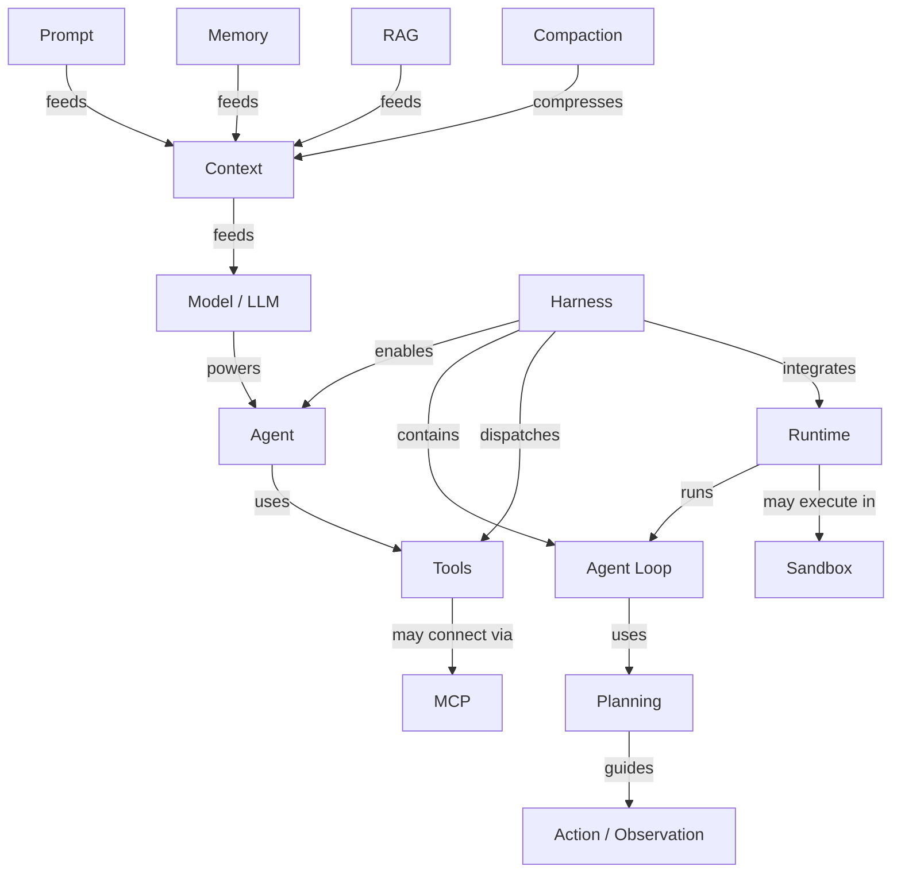

# 核心概念地图

> **Don't just define the term. Locate it.**

Agent Atlas 的核心不是一串互不相关的术语，而是一张不断生长的 **Agent Engineering Concept Graph**。

它帮助学习者回答三个问题：

1. 我现在看到的这个词，属于 Agent 系统的哪一层？
2. 它依赖谁、影响谁、通常和谁一起出现？
3. 如果已经懂了这个词，下一步最值得理解哪个相邻概念？

## 核心骨架

这张 ASCII 图长期保留，因为它适合第一次建立整体直觉：

```text
                       ┌── Prompt
                       │
                  Context
                ↙      ↓       ↘
             Memory   RAG    Compaction
                │
                ↓
Model ─────→ Agent ←──── Harness
                         │
            ┌────────────┼────────────┐
            ↓            ↓            ↓
        Agent Loop      Tools       Runtime
            │            │            │
            ↓            ↓            ↓
         Planning       MCP        Sandbox
            │
            ↓
      Action/Observation
```

## 可点击 Concept Graph

下面是同一套核心骨架的交互视图。点击已有词条的节点，可以进入对应概念页。



!!! note "怎么看这张交互图"
    箭头上的词表达关系类型。例如 `Memory --feeds--> Context` 表示 Memory 中的信息可以被取回并进入当前 Context；`Harness --contains--> Agent Loop` 表示在这套工程心智模型里，Agent Loop 通常是 Harness 的核心组成部分。

!!! warning "这不是唯一正确的 Agent 架构"
    不同框架会把边界画得不一样。Agent Atlas 记录的是帮助学习和比较的概念关系，不把某一家产品架构包装成统一标准。

## 六条主线

### Model → Agent

`Model` 提供语言理解、生成与推理能力；`Agent` 则把模型放进能够围绕目标持续行动的系统中。阅读资料时首先要区分：现在描述的是 **model capability**，还是 **agent system capability**？

### Context → Memory / RAG / Compaction

`Context` 是一次模型调用实际能看到的信息。Memory 中取回的信息、RAG 检索结果、工具结果和 Prompt 都可能进入 Context；Compaction 负责在历史过长时压缩仍需保留的信息。

```text
Memory ≠ Context
RAG ≠ Memory
Compaction ≠ 简单的 Summarization 同义词
```

### Harness → Agent Loop / Tools / Runtime

`Harness` 是围绕模型的执行与控制系统，常见职责包括 Agent Loop、Context management、Tool dispatch、State、Permissions、Retry、Runtime integration 与 Tracing。

### Agent Loop → Planning → Action / Observation

```text
观察当前状态
   ↓
决定下一步
   ↓
执行 Action
   ↓
获得 Observation
   ↓
更新 Context / State
   ↓
继续下一轮或结束
```

### Tools → MCP

`Tools` 是 Agent 可调用的外部能力；`MCP` 不是 Tool 的同义词，而是一种让 AI Host / Client 标准化发现和使用外部 tools、resources、prompts 等能力的协议。

### Runtime → Sandbox

`Runtime` 关注一次 Agent run 如何执行和维持；`Sandbox` 强调在受控边界中隔离代码、命令、文件与网络访问。Runtime 可以包含或连接 Sandbox，但两者不是同一概念。

---

## Concept Graph 的关系类型

| 关系 | 含义 | 示例 |
|---|---|---|
| `contains` | A 通常包含 B | Harness → Agent Loop |
| `feeds` | A 为 B 提供信息 | Memory → Context |
| `uses` | A 使用 B | Agent → Tools |
| `integrates` | A 将 B 接入运行体系 | Harness → Runtime |
| `runs` | A 负责运行 B | Runtime → Agent Loop |
| `isolated-by` | A 受 B 隔离 | Execution → Sandbox |
| `connects` | A 用于连接系统或能力 | Tools → MCP |
| `produces` | A 产生 B | Action → Observation |
| `precedes` | 学习或流程上通常先于 | Planning → Action |
| `contrasts-with` | 概念边界对比 | Agent ↔ Workflow |
| `confused-with` | 高频混淆 | Harness ↔ Framework |
| `evolved-from` | 术语 / 工程范式演化 | Prompt Engineering → Context Engineering |

## 数据驱动

节点和边的机器可读单一数据源位于：

```text
docs/data/concept-graph.json
```

节点记录 `id / label / category / maturity / status / path`，边记录 `from / to / type / label`。CI 会校验节点 ID 唯一、关系端点存在、页面路径有效，从而避免图、导航和词条长期演化后互相矛盾。

同一份数据可以生成不同视图，例如初学者主干图、Context / Memory 专题图、Multi-Agent 图、可靠性图、术语演化图与易混淆概念图。

## 扩展方向

Concept Graph 按三个方向持续扩展：

- **可靠性层**：Evals、Tracing、Observability、Guardrails、Human-in-the-loop、Retry、Checkpoint。
- **多 Agent 层**：Sub-agent、Handoff、Orchestrator、Supervisor、Router、Shared State。
- **工程范式层**：Prompt Engineering、Context Engineering、Harness Engineering、Loop Engineering，以及它们之间的边界与演化。

目标不是画一张看起来复杂的图，而是让读者从任何陌生词出发，都能沿关系找到下一步真正需要理解的概念。
